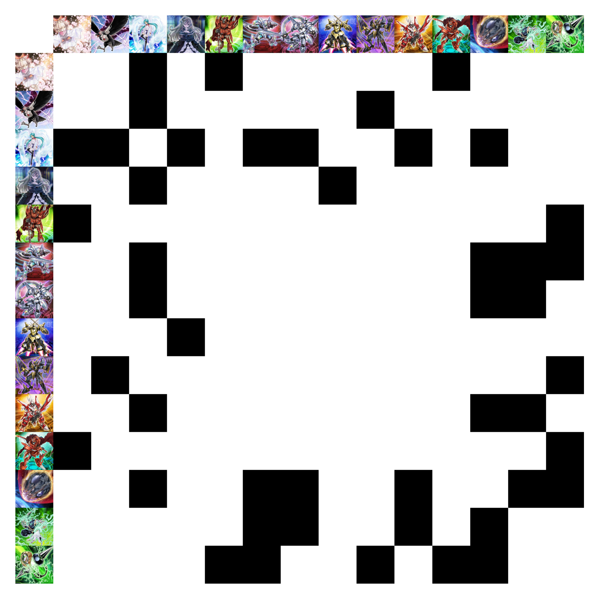

# ygo-small-world

A brige visualizer and recommender for the *Yu-Gi-Oh* card *Small World* using graph theory.

[Use the web app here!](https://smallworld.streamlit.app/)

## Summary

[Small World](https://www.db.yugioh-card.com/yugiohdb/card_search.action?ope=2&cid=16555&request_locale=en) is a *Yu-Gi-Oh!* card which can search any monster in your deck. The idea is that you reveal a card from your hand, reveal a card from your deck with exactly one property in common with your original card, then reveal a third card also with exactly one property in common with the second card, and add that third card to your hand.

In theory, Small World can search any monster from your deck and add it to your hand. However, it may not be possible to bridge a card in your hand to the card that you want to search. The first card you reveal in your deck is referred to as the *bridge* which connects the card you reveal in your hand and the card you add to your hand.

If you use Small World, it is generally desirable to include one or more dedicated bridges that connects many cards in your deck so you have plenty of options for what to search starting from any card. However, such cards are difficult to find due to the many ways that cards can be considered connected. Because of the difficulty in optimizing a deck for Small World, there is a high barrier of entry to use the card.

The purpose of this repository is to assist in finding the best Small World bridges for any deck, as well as to visualize the connections between cards.

## 📖 Table of Contents
1. [📊 Dataset](#-dataset)
2. [🔧 Installation](#-installation)
3. [💻 Running the Code](#-running-the-code)
   - [Streamlit Graphical User Interface](#streamlit-graphical-user-interface)
   - [Command Line Interface](#command-line-interface)
   - [Jupyter Notebooks](#jupyter-notebooks)
4. [🎴 Example](#-example)
5. [🌐 Small World Mathematics](#-small-world-mathematics)
   - [Theorem](#theorem)
   - [Proof](#proof)
   - [Bridge Ranking Algorithm](#bridge-ranking-algorithm)

## 🔧 Installation

### Clone the Repository:

```
git clone https://github.com/KennethJAllen/ygo-small-world
cd ygo-small-world
```
### Install Dependencies with Poetry:

* Install UV if not already installed.
* Create the virtual environment: `uv sync`
* Activate the Virtual Environment
* Install project `uv pip install -e .`

You can now run the project's scripts within the poetry shell.

## 💻 Running the Code

### Streamlit Graphical User Interface

The graphical user interface can be accessed as a streamlit app: https://smallworld.streamlit.app/

To run Streamlit locally: `streamlit run app.py`

### Command Line Interface

- The command line interface for interacting with the Yu-Gi-Oh! Small World analysis tools is through `cli.py`.
- Takes path to `.ydk` file, outputs bridges, adjacency matrix plot, squared adjacency matrix plot, and graph plot to output path (defaults to `./output`)
- Example: `py -m cli "data/sample_deck.ydk"`

### Jupyter Notebook

- For a more interactive approach or for example usage, you can utilize demo the Jupyter notebook located in the `examples/demo.ipynb`.
- Run `fetch_card_data.py` to update the card data to the latest version if needed.
- Alter path to `.ydk` file or update requiored target ids as desired.


## 📊 Dataset

The card data `cardinfo.json` is obtained from the [Yu-Gi-Oh! API](https://ygoprodeck.com/api-guide/).

## 🎴 Example

Consider a Mathmech deck consisting of the monsters
```
'Ash Blossom & Joyous Spring',
'D.D. Crow',
'Effect Veiler',
'Ghost Belle & Haunted Mansion',
'Mathmech Addition',
'Mathmech Circular',
'Mathmech Diameter',
'Mathmech Multiplication',
'Mathmech Nabla',
'Mathmech Sigma',
'Mathmech Subtraction',
'Nibiru, the Primal Being',
'PSY-Frame Driver',
'PSY-Framegear Gamma'.
```
Then the graph of connections via Small World can be visualized as follows.


The adjacency matrix corresponding to cards in a Mathmech deck is the following matrix. If an entry is black, that means the corresponding cards connect via Small World. If an entry is white, that means there is no connection.



Squaring the adjacency matrix, we get the following figure. If an entry is non-white, that means that one corresponding card can be searched from the other. The darker the color, the more connecting bridges the two cards have.


Every entry in the column corresponding to [Mathmech Circular](https://www.db.yugioh-card.com/yugiohdb/card_search.action?ope=2&cid=17430) is non-zero except for the entry corresponding to [Mathmech Multiplication](https://www.db.yugioh-card.com/yugiohdb/card_search.action?ope=2&cid=14748), which means that Mathmech Circular can be searched with Small World starting from any monster in the deck except Mathmech Multiplication.

Moreover, the diagonal entries are the number of connections a card has to another card in the deck. The darker the entry, the more connections a card has to other cards in the deck.

The code to generate these figures may be found in the `examples/demos.ipynb` notebook.

## 🌐 Small World Mathematics
We can use [graph theory](https://en.wikipedia.org/wiki/Graph_theory) to calculate which cards can and cannot be searched via Small World starting from any card.

We can model the cards in a deck as the vertices of an undirected graph $G$. Define an edge between cards $i$ and $j$ if they are a valid connections between each other for Small World. e.g. [Ash Blossom](https://www.db.yugioh-card.com/yugiohdb/card_search.action?ope=2&cid=12950) and [Effect Veiler](https://www.db.yugioh-card.com/yugiohdb/card_search.action?ope=2&cid=8933) would have an edge connecting them because they have the same attack but have different types, attributes, defense, and level. However, Ash Blossom and [Ghost Belle](https://www.db.yugioh-card.com/yugiohdb/card_search.action?ope=2&cid=13587) would not have an edge connecting them.

Let $n$ be the number of distinct monsters in your deck. Label the distinct monsters in your deck is $1$ through $n$. e.g. 'Ash Blossom' is $1$, 'Effect Veiler' is $2$, 'Ghost Belle' is $3$, etc. Let $M$ be the $n \times n$ adjacency matrix of the graph $G$. There is a one in entry $(i,j)$ in $M$ if there is an edge between monster $i$ and monster $j$, with zeros everywhere else. In other words, there is a $1$ in entry $(i,j)$ if monster $i$ and monster $j$ connect through Small World. In this case, entry $(1,2)$ would have a $1$ because Ash Blossom and Effect Veiler connect, but entry $(1,3)$ would be $0$ because Ash Blossom and Ghost Belle do not connect because they have the same level, attack, defense, and type.

### Theorem

Starting with card $i$, you can search card $j$ with Small World if and only if entry $(i,j)$ is non-zero in the matrix $M^2$.

### Proof

Entry $(i,j)$ in $M^2$ is equal to the number of paths of length $2$ from vertex $i$ to vertex $j$ in $G$ (see [properties of the adjacency matrix](https://en.wikipedia.org/wiki/Adjacency_matrix)). If entry $(i,j)$ is zero, then there are no bridges between monsters $i$ and $j$. If entry $(i,j)$ is non-zero, then there is at least one bridge from $i$ to $j$, so $j$ can be searched starting with $i$.

### Bridge Ranking Algorithm

When using the `bridge_generator_examples.ipynb` notebook, there is a `bridge_score` output for each potential bridge $b$. The score is a way of measuring the resulting connectivity of your deck after adding that bridge. A score of $1$ means that every card is searchable from every other card, and a bridge score of $0$ means that there are no cards you can search with Small World, no matter what card you start with.

More specifically, the bridge score for any particular bridge $b$ is the number of pairs of cards $(i,j)$, such that $i$ is searchable starting from $j$ via Small World, divided by $(n+1)^2$. Here $i$ and $j$ can be cards in the deck or the bridge $b$.

In more mathematical terms, consider a potential bridge $b$. Let $M$ be the $n \times n$ adjacency matrix generated by the input deck. Let $x_b$ be the $n \times 1$ vector corresponding to the bridge $b$ which has a $1$ in entry $i$ if card $i$ in the deck connects to the bridge and is zero otherwise. Then the adjacency matrix for the deck, including the bridge $b$, is the $(n+1) \times (n+1)$ matrix

```math
M_b = \begin{bmatrix}M & x_b\\x_b^\top & 0\end{bmatrix}.
```

The bridge score is calculated as the number of non-zero elements in $M_b^2$ divided by $(n+1)^2$.

Because of the block matrix structure of $M_b$, we can express its square as

```math
M_b^2 = \begin{bmatrix}M^2 + x_bx_b^\top & Mx_b\\x_b^\top M & x_b^\top x_b\end{bmatrix}.
```

Because $M$ is symmetric, $x_b^\top M = (Mx_b)^\top$. So to calculate $M_b^2$ we only need to calculate $M^2$ once which is $O(n^3)$. Then for each potential bridge $b$, we calculate $x_bx_b^\top$ and, $Mx_b$ which is $O(n^2)$ each, and, $x_b^\top x_b$ which is $O(n)$.

Therefore if there are $m$ possible bridges $b$, then calculating the Small World bridge score for every bridge with this approach only takes $O(mn^2 + n^3)$ multiplications. This is much better than the naive approach of performing the full matrix multiplication $M_b^2$ for each bridge $b$, which would take $O(mn^3)$ multiplications.
